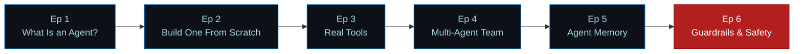

&nbsp;
&nbsp;
&nbsp;

 

---

## 📺 What This Channel Is

> **Practical, no-framework-magic coding tutorials** — you see exactly how things work, not just which library to import.

**Maneesh Code Lab** covers coding fundamentals through advanced practice — **Python**, **Java**, **automation testing** (Selenium, Appium), and, most recently, **building AI agents from raw API calls up**. Every series ships working, runnable code alongside the videos — clone it, run it, take it apart.

---

## 🎬 Playlists

| Playlist | Focus | Code |
|---|---|---|
| 🤖 [**Agentic AI, Unpacked**](https://www.youtube.com/playlist?list=PLlMIXoP9wwAiACpW-BHJwa7o5WUhgLd6-) | Build AI agents step by step — loop, tools, multi-agent, memory, guardrails | [AgenticAI-Unpacked](https://github.com/AutomateCodeLab/AgenticAI-Unpacked) |
| 🐍 [**Python from Scratch**](https://www.youtube.com/playlist?list=PLlMIXoP9wwAi_EBGM-IbrmuKLI9mIsEN6) | Python fundamentals, beginner level | [PythonMastery](https://github.com/AutomateCodeLab/PythonMastery) |
| 🐍 [**Python Advance Series**](https://www.youtube.com/playlist?list=PLlMIXoP9wwAhHLNfvUawpUaORFsCXVT4G) | Advanced Python patterns and practice | [PythonAdvance](https://github.com/AutomateCodeLab/PythonAdvance) |
| ☕ [**Java from Scratch**](https://www.youtube.com/playlist?list=PLlMIXoP9wwAh8ZRpBC9WrWKKngxSp9mvI) | Java fundamentals through practice | [JavaMastery](https://github.com/AutomateCodeLab/JavaMastery) |
| 🧠 [**Machine Learning from Scratch**](https://www.youtube.com/playlist?list=PLlMIXoP9wwAitp5cCLhGwVzBS5U8xQx84) | ML fundamentals, no black boxes | *repo coming soon* |

---

## 🗺️ The Agentic AI Learning Path

Six episodes, one continuous build: the loop → real tools → a team of agents → memory → safety. Every episode is self-contained with tested code and a full README — see [`AgenticAI-Unpacked`](https://github.com/AutomateCodeLab/AgenticAI-Unpacked).

---

## 📘 Featured Book

**From Prompts to Agentic AI** — *Building Agentic AI & Enterprise RAG Systems on Azure*

The production-grade companion to the series: governance, evaluation, guardrails, and Azure-native deployment patterns for agents running at scale.

&nbsp;&nbsp;&nbsp;📖&nbsp; [Kindle Edition](https://www.amazon.in/dp/B0GRD8XTHH)&nbsp;&nbsp;·&nbsp;&nbsp;📗&nbsp; [Paperback](https://www.amazon.in/dp/B0GTLDQSSW)&nbsp;&nbsp;·&nbsp;&nbsp;📕&nbsp; [Hardcover](https://www.amazon.in/dp/B0GTLGXY32)

---

## 🗂️ Repositories

| Repository | What it is |
|---|---|
| 🚩 [**AgenticAI-Unpacked**](https://github.com/AutomateCodeLab/AgenticAI-Unpacked) | Flagship — the 6-episode Agentic AI series, full source code |
| [PythonMastery](https://github.com/AutomateCodeLab/PythonMastery) | Python fundamentals through practice |
| [PythonAdvance](https://github.com/AutomateCodeLab/PythonAdvance) | Advanced Python patterns |
| [JavaMastery](https://github.com/AutomateCodeLab/JavaMastery) | The Java Mastery series |
| [fastapi_inventory_app](https://github.com/AutomateCodeLab/fastapi_inventory_app) | A FastAPI service example |

---

**New videos every week — [subscribe on YouTube](https://www.youtube.com/@ManeeshCodeLab?sub_confirmation=1) to follow along.**

